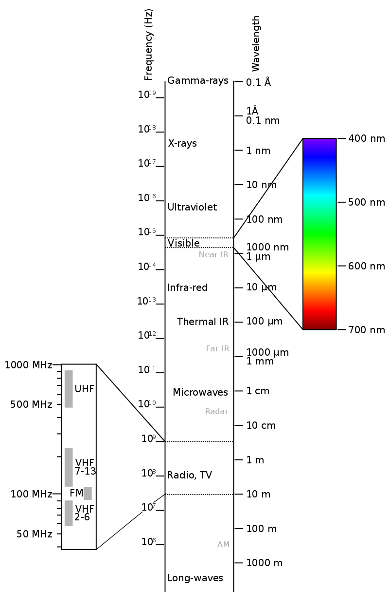

# Notes on Skin Detection Papers

## Skin Detection in Hyperspectral Images `ColorSpaceVNIR.pdf`

### Intro
- Presents novel 2D feature space for detecting skin and supressing common false-alarm sources
- Previous approaches
  - focus on color imagery (due to cost and availability)
  - good detect skin (above 90%) but have high false-alarm
 
### Related work (skin-detection)
- Skin-detection methods in color imagery
  - manipulate color-space channels [14]()
  - use statistical modeling and machine learning methods [14](), [15](), and [16]()
- Color-space channel methods that use two channels
  - red-to-green, red-to-blue, and green-to-blue [18]()
	- result in many false-alarms
	- attempts to reduce false-alarms
		- use rule sets that combina ratios, color-space channel thresholds, and differences. 16, [20]()
		- examine how skin pixels cluster spatially and then attempt to determine if the spatial clustering resembles any body part. [21](), [22]()
- three-channel color-space to train a binary classification system.
	- project pixels onto a plane within color-space that provides the furthest separation between skin and non-skin pixels. [18]()
- color space that separates luminance and chrominance *results in better clustering of skin*. [23]()
- uses cylindrical color spaces (hue, saturation, value; hue, saturation, intensity) *best results*. [24]()
- statistical-based approaches analyze
	- training images for the probability of skin occuring given a pixel in the image
	- probability of skin color occuring in an image overall

### 3. 2D Feature space for skin detection and false-alarm suppression
- one coordinate for skin detection
- second for false-alarm suppression
- `skin detection` and `false-alarm suppression feature` are defined through a fundamental understanding of reflected spectra based on tissue structure and the absorption and scattering of its cnstituent components

> Continuing the rest of annotating on paper, this is too hard. Will still continue to update *term definitions* as needed.

#### Terms Definitions
- __Hyperspectral imaging__: subcategory of *spectral imaging*; combines *spectroscopy* and digital photography
  - 
Hyperspectral Cube

  

- __Spectral imaging__: uses multiple bands across electromagnetic spectrum (beyond RGB bands, e.e. infrared, the visible spectrum, UV, x-rays, etc.)
- __Electromagnetic spectrum__: range of frequencies of electromagnetic radiation and their respective wavelengths and photon energies
  - Wiki image: 
  
- __Spectrum__: not limited to specific set of values but can vary, without steps, across a continuum.
- __chromophores__: part of a molecule responsible for its color
- __Fitzpatrick scale__: six numerical skin types where each skin type is characterized by its likelihood of burning - [wiki](https://en.wikipedia.org/wiki/Fitzpatrick_scale)

